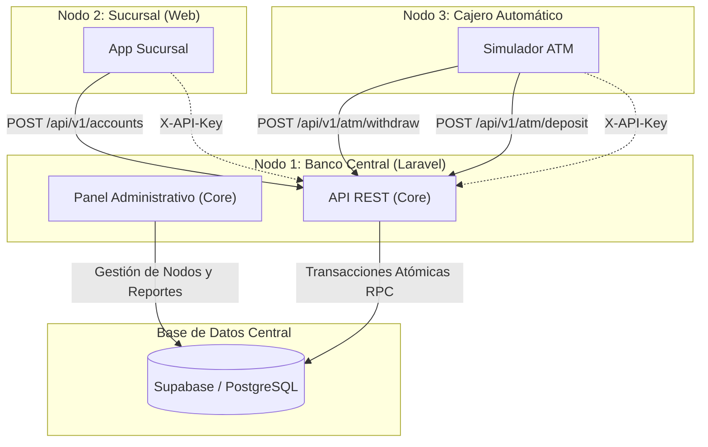

# Sistema Bancario Distribuido - Core (Banco Central)

Este repositorio contiene el núcleo central del Sistema Bancario Distribuido. Se encarga de la gestión global de sucursales y cajeros automáticos, la autenticación de nodos mediante claves de API (`X-API-Key`), la autenticación de administradores centrales y la auditoría inmutable de transacciones.

---

## 🏛 Diagrama de Arquitectura del Sistema

El sistema sigue una arquitectura distribuida donde los nodos (Sucursales y Cajeros) operan de manera independiente, pero sincronizan el saldo global y las transacciones de manera atómica con el núcleo central.

🚀 Enlaces de Despliegue
A continuación se encuentran los enlaces a los entornos de producción de cada uno de los nodos del sistema:

Banco Central (Core): [Enlace de despliegue en Render/Coolify]

Nodo Sucursal: [Enlace de despliegue en Coolify/Vercel]

Nodo Cajero Automático (ATM): [Enlace de despliegue en Vercel]

📚 Especificación OpenAPI (Swagger)
Esta es la especificación técnica de la API para la comunicación segura entre el Banco Central y los Nodos externos.

YAML
openapi: 3.0.0
info:
  title: API Banco Central
  version: 1.0.0
  description: API de comunicación distribuida para nodos del sistema bancario (Sucursales y Cajeros).
servers:
  - url: '[https://tu-dominio-banco-central.com/api/v1](https://tu-dominio-banco-central.com/api/v1)'
    description: Servidor de Producción
components:
  securitySchemes:
    ApiKeyAuth:
      type: apiKey
      in: header
      name: X-API-Key
security:
  - ApiKeyAuth: []
paths:
  /accounts:
    post:
      summary: Apertura de cuenta bancaria
      description: Registra una nueva cuenta con saldo inicial. Exclusivo para nodos tipo "sucursal".
      requestBody:
        required: true
        content:
          application/json:
            schema:
              type: object
              required:
                - account_number
                - holder_name
                - initial_balance
              properties:
                account_number:
                  type: string
                  example: "5430682561"
                holder_name:
                  type: string
                  example: "Juan Pérez"
                initial_balance:
                  type: number
                  example: 1000.00
      responses:
        '200':
          description: Cuenta creada y depósito inicial registrado exitosamente.
        '400':
          description: Datos inválidos o número de cuenta duplicado.
        '403':
          description: Nodo no autorizado o tipo de nodo incorrecto.

  /atm/withdraw:
    post:
      summary: Retiro en cajero automático
      description: Ejecuta un retiro atómico validando el saldo de la cuenta y la disponibilidad del cajero mediante stored procedures.
      requestBody:
        required: true
        content:
          application/json:
            schema:
              type: object
              required:
                - account_number
                - amount
              properties:
                account_number:
                  type: string
                  example: "5430682561"
                amount:
                  type: number
                  example: 200.00
      responses:
        '200':
          description: Retiro exitoso. Retorna el nuevo saldo de la cuenta.
        '400':
          description: Saldo insuficiente, cuenta inactiva o cajero sin efectivo.
        '403':
          description: Clave de API inválida.

  /atm/deposit:
    post:
      summary: Abono / Depósito en cajero automático
      description: Ejecuta un abono atómico a una cuenta e incrementa el saldo en efectivo del cajero correspondiente. Exclusivo para nodos tipo "cajero".
      requestBody:
        required: true
        content:
          application/json:
            schema:
              type: object
              required:
                - account_number
                - amount
              properties:
                account_number:
                  type: string
                  example: "5430682561"
                amount:
                  type: number
                  example: 500.00
      responses:
        '200':
          description: Abono realizado con éxito y saldo actualizado.
        '400':
          description: Cuenta inexistente o monto inválido.
        '403':
          description: Clave de API no autorizada.

  /accounts/{account_number}:
    get:
      summary: Consulta de cuenta y saldo
      description: Retorna la información básica y el saldo actual de una cuenta bancaria.
      parameters:
        - name: account_number
          in: path
          required: true
          schema:
            type: string
          example: "5430682561"
      responses:
        '200':
          description: Datos de la cuenta obtenidos exitosamente.
        '404':
          description: Cuenta no encontrada.