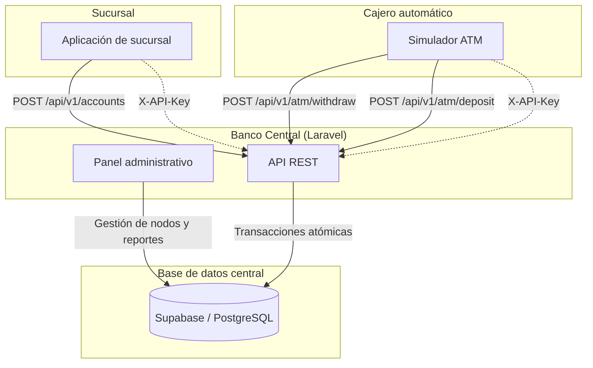

# Sistema Bancario Distribuido - Core (Banco Central)

Este repositorio contiene el núcleo central del Sistema Bancario Distribuido. El proyecto centraliza la gestión de sucursales, cajeros automáticos, nodos autorizados, autenticación con `X-API-Key` y la auditoría inmutable de transacciones.

## Descripción general

El sistema está diseñado para operar como un núcleo financiero distribuido:

- Cada sucursal y cada cajero se registra como un nodo autorizado.
- Las sucursales pueden abrir cuentas y registrar depósitos iniciales.
- Los cajeros pueden realizar retiros y depósitos de forma atómica.
- El Banco Central valida la identidad del nodo mediante cabeceras de seguridad.
- Todas las transacciones quedan registradas para auditoría y consulta.

---

## 🏛 Arquitectura



---

## Características principales

- Autenticación de nodos por clave API (`X-API-Key`).
- Registro y administración central de sucursales y cajeros.
- Apertura de cuentas con saldo inicial.
- Consulta de saldo y estado de la cuenta.
- Operaciones ATM con validación de saldo y disponibilidad.
- Reportes transaccionales para auditoría y monitoreo.

---

## Requisitos

- PHP 8.3+
- Composer
- Node.js + npm
- SQLite (configuración por defecto en `.env.example`)

---

## Instalación

1. Clona el repositorio.
2. Instala dependencias de PHP:

   ```bash
   composer install
   ```

3. Configura el archivo de entorno:

   ```bash
   cp .env.example .env
   php artisan key:generate
   ```

4. Ejecuta las migraciones:

   ```bash
   php artisan migrate
   ```

5. Instala dependencias frontend:

   ```bash
   npm install
   npm run build
   ```

6. Inicia la aplicación:

   ```bash
   php artisan serve
   ```

La aplicación queda disponible en `http://localhost:8000`.

---

## API y autenticación

La API del Banco Central usa el encabezado `X-API-Key` para identificar a cada nodo autorizado.

### Endpoints principales

| Método | Ruta | Descripción |
| --- | --- | --- |
| `POST` | `/api/v1/nodes` | Registrar un nuevo nodo |
| `GET` | `/api/v1/nodes` | Listar nodos |
| `GET` | `/api/v1/reports/transactions` | Consultar historial de transacciones |
| `POST` | `/api/v1/accounts` | Abrir cuenta desde una sucursal |
| `POST` | `/api/v1/atm/withdraw` | Retiro en cajero |
| `POST` | `/api/v1/atm/deposit` | Depósito en cajero |
| `GET` | `/api/v1/accounts/{account_number}` | Consultar cuenta y saldo |

---

## Especificación OpenAPI

La siguiente especificación describe el contrato principal de la API para comunicación segura entre el Banco Central y los nodos externos.

```yaml
openapi: 3.0.0
info:
  title: API Banco Central
  version: 1.0.0
  description: API de comunicación distribuida para nodos del sistema bancario (sucursales y cajeros).
servers:
  - url: https://tu-dominio-banco-central.com/api/v1
    description: Servidor de producción
components:
  securitySchemes:
    ApiKeyAuth:
      type: apiKey
      in: header
      name: X-API-Key
security:
  - ApiKeyAuth: []
paths:
  /accounts:
    post:
      summary: Apertura de cuenta bancaria
      description: Registra una nueva cuenta con saldo inicial. Exclusivo para nodos tipo "sucursal".
      requestBody:
        required: true
        content:
          application/json:
            schema:
              type: object
              required:
                - account_number
                - holder_name
                - initial_balance
              properties:
                account_number:
                  type: string
                  example: "5430682561"
                holder_name:
                  type: string
                  example: "Juan Pérez"
                initial_balance:
                  type: number
                  example: 1000.00
      responses:
        '200':
          description: Cuenta creada y depósito inicial registrado exitosamente.
        '400':
          description: Datos inválidos o número de cuenta duplicado.
        '403':
          description: Nodo no autorizado o tipo de nodo incorrecto.

  /atm/withdraw:
    post:
      summary: Retiro en cajero automático
      description: Ejecuta un retiro atómico validando el saldo de la cuenta y la disponibilidad del cajero.
      requestBody:
        required: true
        content:
          application/json:
            schema:
              type: object
              required:
                - account_number
                - amount
              properties:
                account_number:
                  type: string
                  example: "5430682561"
                amount:
                  type: number
                  example: 200.00
      responses:
        '200':
          description: Retiro exitoso. Retorna el nuevo saldo de la cuenta.
        '400':
          description: Saldo insuficiente, cuenta inactiva o cajero sin efectivo.
        '403':
          description: Clave de API inválida.

  /atm/deposit:
    post:
      summary: Abono en cajero automático
      description: Ejecuta un abono atómico a una cuenta e incrementa el saldo en efectivo del cajero.
      requestBody:
        required: true
        content:
          application/json:
            schema:
              type: object
              required:
                - account_number
                - amount
              properties:
                account_number:
                  type: string
                  example: "5430682561"
                amount:
                  type: number
                  example: 500.00
      responses:
        '200':
          description: Abono realizado con éxito y saldo actualizado.
        '400':
          description: Cuenta inexistente o monto inválido.
        '403':
          description: Clave de API no autorizada.

  /accounts/{account_number}:
    get:
      summary: Consulta de cuenta y saldo
      description: Retorna la información básica y el saldo actual de una cuenta.
      parameters:
        - name: account_number
          in: path
          required: true
          schema:
            type: string
          example: "5430682561"
      responses:
        '200':
          description: Datos de la cuenta obtenidos exitosamente.
        '404':
          description: Cuenta no encontrada.
```

---

## Enlaces de despliegue

A continuación se tienen referencias de entorno de despliegue del sistema:

- Banco Central (Core): [Pendiente de configuración]
- Nodo Sucursal: [Pendiente de configuración]
- Cajero Automático (ATM): [Pendiente de configuración]

---

## Estado del proyecto

Este repositorio corresponde al núcleo del sistema bancario distribuido y está listo para ser extendido con la capa de frontend de sucursal, simulador de cajero y procesos adicionales de despliegue y monitoreo.
